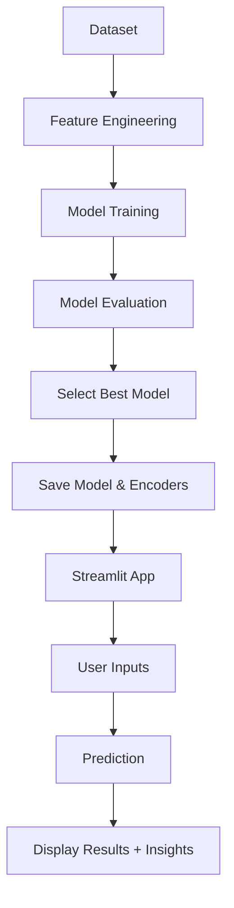
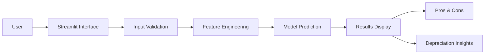

# Project Structure

```
Royal Enfield Bike Price Prediction/
│
├── 📊 Data Files
│   ├── royal_enfield_data.csv              # Sample dataset (30 rows)
│   └── depreciation_analysis.png           # Depreciation visualization
│
├── 🧠 Model Training
│   ├── train_model.py                      # Main training script
│   ├── royal_enfield_model.pkl             # Trained model (Linear Regression)
│   ├── le_model.pkl                        # Model encoder
│   ├── le_owner.pkl                        # Owner encoder
│   ├── le_transmission.pkl                 # Transmission encoder
│   └── royal_enfield_price_prediction.ipynb # Jupyter Notebook analysis
│
├── 🚀 Deployment
│   └── app.py                              # Streamlit web application
│
├── 📈 Analysis
│   └── depreciation_analysis.py            # Depreciation pattern analysis
│
├── 🧪 Testing
│   └── test_project.py                     # Project verification script
│
├── 📄 Documentation
│   ├── README.md                           # Project guide
│   ├── PROJECT_SUMMARY.md                  # File descriptions
│   └── PROJECT_STRUCTURE.md                # This file
│
├── ⚙️ Configuration
│   └── requirements.txt                    # Python dependencies
│
└── 📦 Generated Outputs
    └── depreciation_analysis.png           # Analysis visualization
```

## 🎯 Key Components

### Data Layer
- **Dataset**: 30 sample records of Royal Enfield bikes with features and prices
- **Visualization**: Depreciation patterns by age and model

### Model Layer
- **Training Script**: Compares Linear Regression, Random Forest, and Gradient Boosting
- **Best Model**: Linear Regression (R² = 0.9686)
- **Encoders**: For categorical variables (Model, Owner, Transmission)

### Application Layer
- **Streamlit App**: Web interface for price predictions
- **Features**: 
  - Input form for bike details
  - Price prediction with ₹ value
  - Pros & Cons for each model
  - Depreciation insights

### Analysis Layer
- **Jupyter Notebook**: Detailed exploratory data analysis
- **Depreciation Analysis**: Box plots for age and model comparisons

## 🔄 Workflow



## 📊 Data Schema

### royal_enfield_data.csv
| Column | Type | Description |
|--------|------|-------------|
| Model | String | Classic 350, Bullet 350, Himalayan, Meteor 350, Hunter 350 |
| Year | Integer | Manufacturing year |
| Present_Price | Float | Original price in Lakhs |
| Kms_Driven | Integer | Total kilometers driven |
| Owner | String | First, Second, or Third owner |
| Transmission | String | Manual (all in sample) |
| Selling_Price | Float | Target variable in Lakhs |

## 🧠 Model Performance

| Model | R² Score | RMSE | MAE |
|-------|----------|------|-----|
| Linear Regression | 0.9686 | 0.0558 | 0.0430 |
| Random Forest | 0.9349 | 0.0803 | 0.0700 |
| Gradient Boosting | 0.9043 | 0.0974 | 0.0799 |

## 🚀 Deployment Architecture

